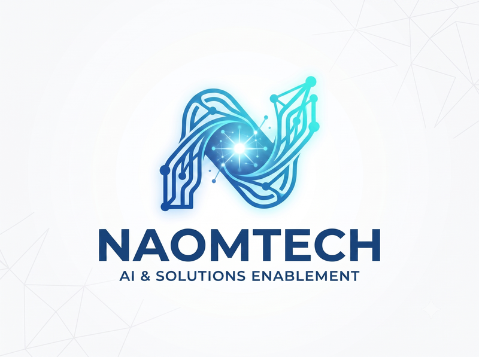

# Manohar Papasani

**GenAI Solution Architect &middot; Forward Deployed AI Solutions Engineer &middot; SRE & Automation Lead**

📍 Hyderabad, India &nbsp;|&nbsp; 📧 [technaom@gmail.com](mailto:technaom@gmail.com) &nbsp;|&nbsp; 🔗 [linkedin.com/in/manohar-p-b89916aa](https://linkedin.com/in/manohar-p-b89916aa)

10+ years in software, specializing in enterprise Generative AI adoption, agentic AI pipelines, and site-reliability automation. I design and ship production-grade RAG systems, LLMOps frameworks, and deterministic automation that save real engineering time — not proofs of concept that stay in a notebook.

**~14,300 engineer-hours saved annually**, delivered by architecting a compliance-automation framework now running at enterprise scale — one of several production systems I've built end to end, from architecture through deployment.

---

## 🏆 Recognition

**29 awards over 5 years at Bank of America**, including **1 Platinum** — the bank's highest delivery recognition, given to very few people across all teams — awarded this year for GenAI leadership and enterprise AI adoption, alongside a Gold award for enablement work. (8 Gold &middot; 7 Silver &middot; 12 Bronze &middot; 6 High-Five awards &middot; 100+ eCards.)

---

## 🛠️ What I build

**Enterprise-scale, in production:**
- **Compliance automation framework** — a structured prompt-engineering system covering a full 4-phase review lifecycle and 15 audit controls, cutting review time from 40 to 10 minutes and automating 28,600+ reviews a year (4× throughput). Built the organization's most comprehensive prompt library (10,000+ prompts).
- **Deterministic rule-engine rebuild** — re-architected that same system into a schema-gated JSON rule catalog (130 rules, zero LLM calls at runtime, zero data egress) for full audit traceability — ~95% faster turnaround on a ~5,000-line engine.
- **Production RAG knowledge system** — turned recurring team Q&A into a persistent, semantically searchable knowledge base (LangChain + ChromaDB + Streamlit) serving 100–150 practitioners on demand.
- **Enterprise Copilot rollout** — drove GitHub Copilot, Teams Copilot, and Microsoft 365 Copilot adoption across a 100–150 person delivery organization; founded the org's prompt-engineering team and mentored 8–10 teams to ship 80+ of the 200+ automations delivered enterprise-wide.

**Open source / independent builds — see the code:**

| | |
|---|---|
| **[rag-projects](https://github.com/TechNaom/rag-projects)** | End-to-end RAG architecture — chunking, retrieval, generation, and evaluation, built from scratch on Python, LangChain, Chroma DB, scikit-learn, and Ollama/Groq for generation. |
| **[genai-lab](https://github.com/TechNaom/genai-lab)** | A personal engineering blog/knowledge base for AI content — Next.js frontend, FastAPI backend, Markdown-based publishing, deployed as containerized services on Render. |

**Core strengths:** GenAI solution architecture &middot; RAG & vector search (ChromaDB, FAISS) &middot; LLMOps & multi-model orchestration (LangChain, LangSmith, Galileo) &middot; agentic automation pipelines &middot; SRE & incident response (RCA, SLO/SLI) &middot; Python engineering &middot; AWS & CI/CD.

---

## 📘 Also teaching (added advantage, not the day job)

I occasionally turn what I build into free, structured learning material — same engineering rigor, aimed at helping others skip the trial-and-error.

- **[Python for Everyone](https://github.com/TechNaom/python-for-everyone)** — free, interactive Python course. **[Live →](https://technaom.github.io/python-for-everyone/)**
- **[GenAI for Everyone](https://github.com/TechNaom/genai-for-everyone)** — free, job-ready 7-week GenAI program.

---

📫 Open to conversations on GenAI architecture, LLMOps, and enterprise AI adoption — reach me at **[technaom@gmail.com](mailto:technaom@gmail.com)** or **[LinkedIn](https://linkedin.com/in/manohar-p-b89916aa)**.
